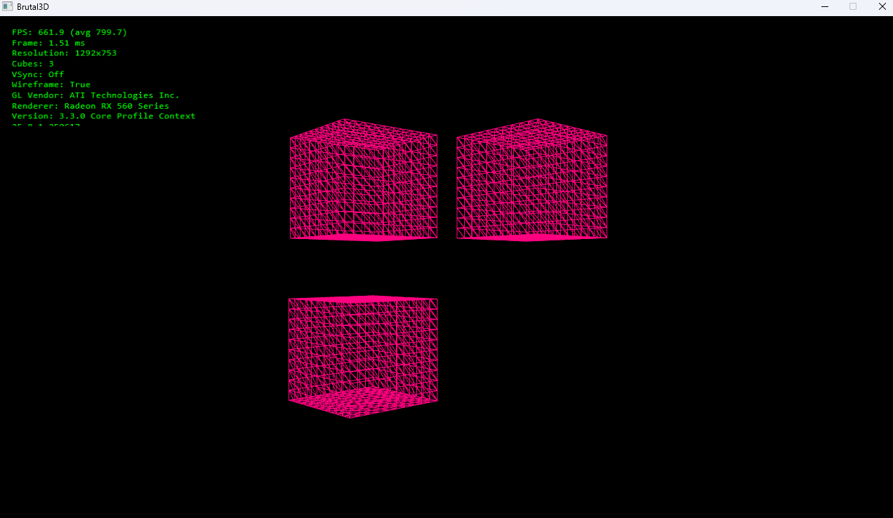
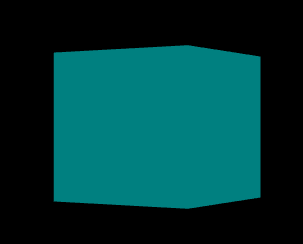

# Brutal3D v0.2 Alpha

**Fast, customizable 3D cube renderer for Windows.**  

Brutal3D is a lightweight app that lets you spawn, color, and render 3D cubes with adjustable speed, count, and visual quality. Perfect for testing, messing around, or just showing off some chaotic cube action.

## Features

- Adjust cube speed and cube count  
- Customizable cube color and textures *(NOTE: Textures are in beta)*  
- MSAA anti-aliasing support  
- Resolution and screen mode selection  
- VSync and framerate cap options  
- Wireframe and debug overlay modes  
- Ultra-fast 3D rendering performance  

## Screenshots

  

## Download

Grab the latest version from releases: [Brutal3D v0.2 Alpha](Brutal3D.zip)

## Known Issues

- Textures can and will load strangely on the cube   
- No auto-save of settings (everything resets on restart)  
- you tell me

## License

Do whatever you want with the code — it's bad anyways.

## How to Run

1. Download the zip.  
2. Extract the contents.  
3. Run `Brutal3D.exe` on Windows.  
4. Configure your settings in the launcher and press **Start**.  
5. Press **ESC** to quit the app.  

> **Note:** This is an alpha version. Bugs and crashes are expected — have fun experimenting!
